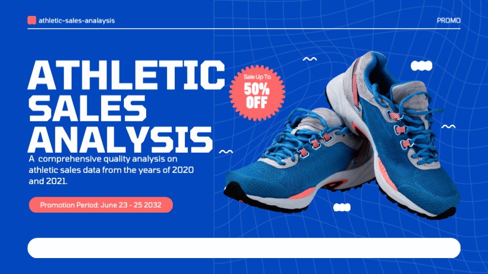

# athletic-sales-analysis

## Overview

This analysis focuses on refining and dissecting athletic sales data for a company. The process involved merging dataframes, standardizing and adjusting column names, and filtering large datasets to pin point specific statistics, organize data, and enhance overall readability. Utilizing the groupby() and pivot_table() functions, several key insights were obtained, including:

- The region with the highest product sales
- The region generating the most revenue
- The retailer with the highest sales volume
- The retailer leading in sales of Women's Athletic Footwear

## 🔦 Analysis Features

In this assignment, several key features were incorporated, focusing on how the data was broken down. We started with two separate datasets from 2020 and 2021, using the groupby() and pivot_table() functions for our initial layer of analysis.

The second layer of analysis involved filtering the dataset using the loc() function to extract all rows related to Women's Athletic Footwear from the 'product' column. Once this data was isolated, the groupby() and pivot_table() functions were instrumental in organizing and grouping the data.

The final feature was a self-imposed challenge based on recent lessons, which involved formatting the money columns. I created a function called format_sales(column). This function takes a column, divides the value by one million, and formats it with a dollar sign and 'M' to represent millions, for example, $ 8.5 M.

## 📲 The Process

#### Pre-Processing

| Step(s)         | Description         |
| ----------------- | ---------------- |
| **Step 1:** Import required packages:   | Import packages and read in 2020 and 2021 csv files into dataframes using 'pd.read_csv'.     |
| **Step 2:** Combining Dataframes:      | Using the concat() function, this made combining the data from two separate csv files (for years 2020 and 2021) together into one dataframe as ease. Axis=0 ensures the two dataframes are connected by rows, **not**  side by side adding additonal columns ❌. This means that the additional data will be listed under the last row, adding additional rows ✅ |
| **Step 3:** Convert the date column to datatype 🕰️ datetime: | The 'invoice_date' columns holds date which can be easily accessed by converting the column to a datetime datatype.    |
---
#### Most Products Offered 'Total Number of Products' - Region, State, City
**Step 1:** Filter by # of products sold by region, state, city, and product: In this step, the goal is to separate the data using the groupby() and pivot_table() functions to find the total. The end product should show you the number of product for each region, state, and city.    

**Step 2:** Clean & Sort Data: Once the data is filtered into region, state, and city we can rename the columns for better visibility and sort the data in descending order to locate the store(s) in a specific region, state, and city that offer the most products on shelf.    

---
#### Most Sales 'Total Sales' - Region, State, City
**Step 1:** Filter 'total_sales' by region, state, city, and product: In this step, the goal is to separate the data using the groupby(), applied .sum() to total the sales. Using pivot_table() function, applied the sum function through the aggfunc as a parameter of the pivot_table function.    

**Step 2:** Clean & Sort Data: Once the data is filtered into region, state, and city we can rename the columns for better visibility and sort the data in descending order to locate the top store(s) with the most sales, listed by region, state, and city. 
---
#### Most Sales 'Total Sales' - Retailer
**Step 1:** Filter 'total_sales' by retailer, region, state, city, and product: In this step, the goal is to separate the data using the groupby(), applied .sum() to total the sales. Using pivot_table() function, applied the sum function through the aggfunc as a parameter of the pivot_table function.    

**Step 2:** Clean & Sort Data: Once the data is filtered by retailer we can rename the columns for better visibility and sort the data in descending order to locate the top retailer with the most sales.

## 🔬 Key Findings

| **Summary Finding**                | **Summary Analysis**     |
| ------------------------------ | -------- |
| **Number of Products Sold by Region, State, and City** | The highest number of products offered by a single store is 216.| 
| **Most Sales by Region, State, and City**              | The region, state, and city with the highest sales is the Northeast region, specifically New York, New York. Here, Men's Street Footwear sales totaled $8.28 million, followed closely by Women's Apparel with $7.8 million in sales.| 
 |**Most Sales by Retailer**  | The retailer with the highest sales is West Gear, located in San Francisco, California, within the Western region. They achieved $6.64 million in sales, primarily from Women's Apparel.|      
 |**Retailer - Most Sold Women's Athletic Footwear**    | West Gear, also in San Francisco, California, leads in units sold of Women's Athletic Footwear, with a total of 12,107 units. |  
 |**Women's Athletic Footwear - Most Sold by Day**    | The highest sales day for Women's Athletic Footwear over the two years 2020 and 2021 was July 7, 2021, with 540,000 units sold.|
 |**Women's Athletic Footwear - Most Sold by Week**   | The week of July 11, 2021, saw the highest sales of Women's Athletic Footwear, with a total of 1,675,000 units sold. |                                        

## References

[Xpert Learning Asssistant](https://bootcampspot.instructure.com/courses/6028/external_tools/313) - Assisted in debugging throughout assignment.
[Chatgpt](https://chatgpt.com/)- Proofreading and spell check README.